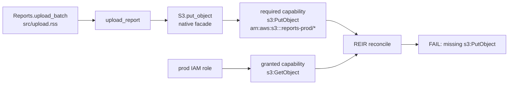

# S3 IAM REIR demo

This demo shows a PR review story:

```text
base: 00-fixed
head: 03-code-adds-delete

PR change:
  Reports.cleanup_old_reports -> S3.delete_object

Existing prod IAM:
  grants only s3:PutObject

RSScript / REIR result:
  new required capability: s3:DeleteObject
  deployment missing: s3:DeleteObject
  evidence: src/upload.rss:28 Reports.cleanup_old_reports -> S3.delete_object
  decision: fail pre-deploy
```

Run the PR-review golden test:

```sh
cargo test --test s3_iam_reir_demo_e2e s3_iam_reir_demo_pr_review -- --nocapture
```

Expected output includes:

```text
s3 iam pr review: blocked missing=s3:DeleteObject evidence=src/upload.rss:28
```

The checked-in PR comment is [expected/pr-comment.md](expected/pr-comment.md).

## Core loop

The underlying REIR loop is:

1. RSScript code uploads reports to S3 through an async package facade.
2. `rsspkg.toml` binds the facade symbol `S3.put_object` to one external capability.
3. Package review propagates that capability through the RSScript call graph.
4. REIR reconciles required code capabilities against mock IAM grants before deploy.

The RSS source does not write `effects(requires(...))`. The capability binding is declared once at the package boundary.
`interface/s3.rssi` is the mock native S3 boundary. `src/upload.rss` is ordinary RSS async business code; it is not a native implementation.
The runtime path is also executable: `rsscript-runtime` owns the Tokio-backed native async executor, while the demo native wrapper only starts HTTP IO futures.

## Evidence chain



```text
Scenario                 Required          Granted                 Result
00-fixed                 PutObject         PutObject               PASS
01-missing-iam           PutObject         GetObject               FAIL: missing PutObject
02-excess-iam            PutObject         PutObject+DeleteObject  WARN: excess DeleteObject
03-code-adds-delete      Put+Delete        PutObject               FAIL: missing DeleteObject
04-native-risk           PutObject         PutObject               REVIEW: native boundary risk
05-missing-binding       native call       no capability binding   FAIL: unknown, not safe
```

## Run the full demo flow with the Rust test runner

```sh
cargo test --test s3_iam_reir_demo_e2e s3_iam_reir_demo_fails_preflight_then_passes_and_shows_async_io_gain -- --ignored --nocapture
```

Expected flow:

1. REIR fails before deploy because mock IAM grants `s3:GetObject`, not `s3:PutObject`.
2. The fixed IAM mock grants `s3:PutObject`, and REIR passes.
3. The excess IAM mock grants `s3:DeleteObject`, and REIR reports an unused security capability.
4. The RSS async uploader sends six 256 KiB objects through `rsscript-runtime::spawn_tokio_native`.
5. A blocking sync client uploads the same number and size of objects sequentially.

The test runner starts the Tokio mock S3 server, builds the generated RSS package, times a warmed async upload, times the blocking sync client, and asserts that the server saw overlapping async requests. It does not use shell scripts.

## Run the fast preflight only

```sh
cargo test --test s3_iam_reir_demo_e2e s3_iam_reir_demo_preflight -- --nocapture
```

Expected output includes:

```text
s3 iam preflight: missing=s3:PutObject fixed=covered excess=s3:DeleteObject
```

This path does not start the mock S3 server or build the native runtime binaries. It only proves the review/security loop:

- required: `object_storage.write aws/s3 s3:PutObject arn:aws:s3:::reports-prod/*`
- missing grant fixture: `object_storage.read aws/s3 s3:GetObject arn:aws:s3:::reports-prod/*`
- excess grant fixture: `object_storage.delete aws/s3 s3:DeleteObject arn:aws:s3:::reports-prod/*`
- evidence: `src/upload.rss:8 upload_report -> S3.put_object`

## Reviewer scenario matrix

The scenario fixtures are small package snapshots that model PR review questions without duplicating the runtime benchmark:

```text
Scenario                 Reviewer question                         Expected REIR result
00-fixed                 Does the deployed role cover uploads?       PutObject covered
01-missing-iam           Would this deployment fail?                 PutObject missing
02-excess-iam            Is the service overprivileged?              DeleteObject excess
03-code-adds-delete      Did the PR add a new external ability?      new DeleteObject requirement
04-native-risk           Is native risk hidden in the wrapper?       build/unsafe policies require review
```

Run the scenario-only test:

```sh
cargo test --test s3_iam_reir_demo_e2e s3_iam_reir_demo_scenarios -- --nocapture
```

Expected output includes:

```text
s3 iam scenarios: fixed=PutObject code-change-adds=DeleteObject fixed-iam=missing-delete excess-iam=covers-delete
```

The `03-code-adds-delete` package adds `Reports.cleanup_old_reports -> S3.delete_object` and a package capability binding for `object_storage.delete / s3:DeleteObject`. The test verifies that the old fixed IAM fixture no longer covers the package, while the excess fixture covers the new delete requirement.

Run the native-risk scenario:

```sh
cargo test --test s3_iam_reir_demo_e2e s3_iam_reir_demo_native_risk -- --nocapture
```

Expected output includes:

```text
s3 iam native-risk: native-wrapper build-scripts unsafe-policy require review
```

Run the missing-binding negative control:

```sh
cargo test --test s3_iam_reir_demo_e2e s3_iam_reir_demo_missing_capability -- --nocapture
```

Expected output includes:

```text
s3 iam negative-control: missing capability binding is unknown
```

The checked-in negative-control output is [expected/missing-capability-binding.txt](expected/missing-capability-binding.txt).

## AI patch story

The prompt in [prompts/add-cleanup.md](prompts/add-cleanup.md) asks for a cleanup function that deletes old reports. The representative generated patch in [ai-output/cleanup.patch](ai-output/cleanup.patch) adds `Reports.cleanup_old_reports -> S3.delete_object`.

That code can be represented in RSScript, but package review turns the new external ability into a semantic fact. With the existing fixed IAM fixture, REIR blocks the PR before deploy because prod grants only `s3:PutObject`.

## Review cost shape

```text
Review task: Did this PR add a deployment-relevant capability?

Raw artifacts to inspect:
  src/upload.rss
  interface/s3.rssi
  rsspkg.toml
  native/bindings.rssbind.toml
  native/rust/src/lib.rs
  infra/mock-iam-fixed.json

RSScript/REIR findings:
  added required capability: s3:DeleteObject
  missing grant: s3:DeleteObject
  evidence: src/upload.rss:28 Reports.cleanup_old_reports -> S3.delete_object
  native wrapper risk: explicit package review boundary
```

## What the preflight proves

The e2e test reads these fixture files directly:

- `infra/mock-iam-missing.json`
- `infra/mock-iam-fixed.json`
- `infra/mock-iam-excess.json`
- `infra/mock-runtime.json`

The missing case fails because mock IAM grants `s3:GetObject`, while the RSS package requires `s3:PutObject`.
The mock runtime grants still cover `runtime.native` and `network.client`, so the failure is isolated to the missing S3 IAM action.

The missing capability evidence points back to RSS call sites, including `Reports.upload_batch -> upload_report -> S3.put_object` and `upload_report -> S3.put_object`.
The fixed case grants `s3:PutObject`, and the REIR reconciliation has no missing capabilities.
The excess case also grants `s3:DeleteObject`, and REIR reports it as an unused security-relevant capability.

## Async note

`Reports.upload_batch` first calls `upload_report` to show ordinary RSS call graph propagation, then uses `task_group` with multiple `async let` uploads to demonstrate structured concurrency. RSScript source does not expose Tokio, Future, Pin, Poll, or Waker; those remain runtime implementation details.
